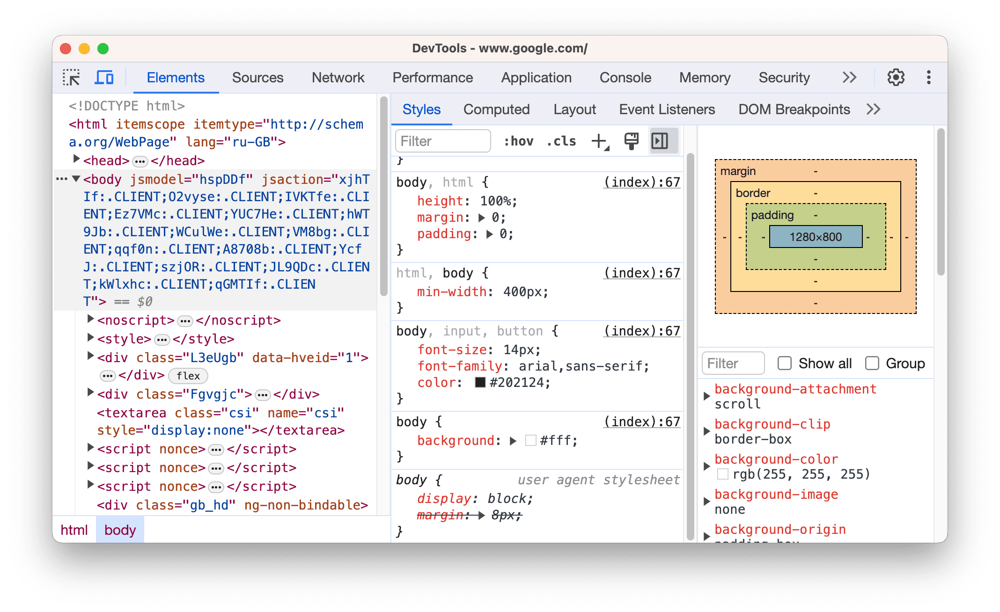

# ⏏️ Cómo ejecutar JavaScript

Podemos ejecutarlo de **2 formas**

#### 1. Chrome Browser:&#x20;

Directamente en el navegador de Chrome con la opción de **inspeccionar** y [**herramientas de desarrolador**.](https://developer.chrome.com/docs/devtools)

```
Botón derecho > Inspeccionar > Consola
```

<figure><figcaption></figcaption></figure>

#### 2. Codepen: [https://codepen.io/](https://codepen.io/)

<figure><figcaption></figcaption></figure>
